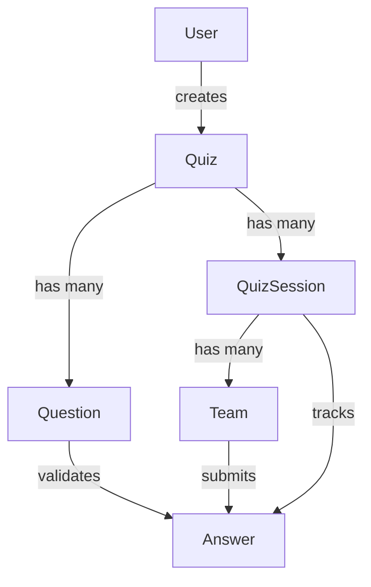

# HSD Arena API Documentation v2.0

Backend API ve WebSocket event dokümantasyonu - Yeniden yapılandırılmış versiyon

---

## 📋 İÇİNDEKİLER

### 🔐 Authentication & User Management
- [AUTHENTICATION ENDPOINTS](#-authentication-endpoints)
  - [POST /api/auth/register](#post-apiauthregister)
  - [POST /api/auth/login](#post-apiauthlogin)
  - [POST /api/auth/logout](#post-apiauthlogout)
  - [GET /api/auth/me](#get-apiauthme)
- [USER SETTINGS ENDPOINTS](#-user-settings-endpoints)
  - [PATCH /api/users/me/email](#patch-apiusersmeemail)
  - [PATCH /api/users/me/password](#patch-apiusersmepassword)
  - [DELETE /api/users/me](#delete-apiusersme)

### 📝 Quiz & Question Management (Admin)
- [ADMIN - QUIZ ENDPOINTS](#-admin---quiz-endpoints)
  - [POST /api/admin/quizzes](#post-apiadminquizzes)
  - [GET /api/admin/quizzes](#get-apiadminquizzes)
  - [GET /api/admin/quizzes/:quizId](#get-apiadminquizzesquizid)
  - [PUT /api/admin/quizzes/:quizId](#put-apiadminquizzesquizid)
  - [DELETE /api/admin/quizzes/:quizId](#delete-apiadminquizzesquizid)
- [ADMIN - QUESTION ENDPOINTS](#-admin---question-endpoints)
  - [POST /api/admin/quizzes/:quizId/questions](#post-apiadminquizzesquizidquestions)
  - [GET /api/admin/quizzes/:quizId/questions](#get-apiadminquizzesquizidquestions)
  - [PUT /api/admin/questions/:questionId](#put-apiadminquestionsquestionid)
  - [DELETE /api/admin/questions/:questionId](#delete-apiadminquestionsquestionid)

### 🎮 Session Management
- [ADMIN - SESSION ENDPOINTS](#-admin---session-endpoints)
  - [POST /api/admin/quizzes/:quizId/session](#post-apiadminquizzesquizidsession)
  - [GET /api/admin/sessions/:sessionCode](#get-apiadminsessionssessioncode)
  - [GET /api/admin/sessions/:sessionCode/scoreboard](#get-apiadminsessionssessioncodescoreboard)
  - [POST /api/admin/sessions/:sessionCode/start](#post-apiadminsessionssessioncodestart)
- [PUBLIC/TEAM - SESSION ENDPOINTS](#publicteam---session-endpoints)
  - [GET /api/sessions/:sessionCode/quiz](#get-apisessionssessioncodequiz)
  - [GET /api/sessions/:sessionCode/question/current](#get-apisessionssessioncodequestioncurrent)
  - [POST /api/sessions/:sessionCode/answer](#post-apisessionssessioncodeanswer)
  - [GET /api/sessions/:sessionCode/teams](#get-apisessionssessioncodeteams)

### 👥 Team Management
- [TEAM ENDPOINTS](#-team-endpoints)
  - [POST /api/teams/join](#post-apiteamsjoin)

### 📚 Technical Reference
- [REQUEST/RESPONSE TYPE DEFINITIONS](#-requestresponse-type-definitions)
  - [Authentication DTOs](#authentication-dtos)
  - [Quiz Management DTOs](#quiz-management-dtos)
  - [Question DTOs](#question-dtos)
  - [Session DTOs](#session-dtos)
  - [Team DTOs](#team-dtos)
  - [User Settings DTOs](#user-settings-dtos)
- [DATABASE MODELS (PRISMA SCHEMA)](#%EF%B8%8F-database-models-prisma-schema)
  - [Enums](#enums)
  - [User Model](#user-model)
  - [Quiz Model](#quiz-model)
  - [Question Model](#question-model)
  - [QuizSession Model](#quizsession-model)
  - [Team Model](#team-model)
  - [Answer Model](#answer-model)
  - [Field Type Mappings](#field-type-mappings)
  - [Relationships Diagram](#relationships-diagram)
  - [Cascade Delete Rules](#cascade-delete-rules)

### 🔌 WebSocket & Real-time
- [WEBSOCKET EVENTS](#-websocket-events)
  - [CONNECTION EVENTS](#connection-events)
  - [SESSION EVENTS](#session-events)
  - [QUESTION EVENTS](#question-events)
  - [ANSWER EVENTS](#answer-events)
  - [SCOREBOARD EVENTS](#scoreboard-events)
  - [ADMIN CONTROL EVENTS](#admin-control-events)
- [WebSocket Integration Guide](#-websocket-integration-guide)
  - [Basic Connection](#basic-connection)
  - [React Integration Example](#react-integration-example)
  - [Vue.js Integration Example](#vuejs-integration-example)
  - [Error Handling](#error-handling)
  - [Reconnection Strategy](#reconnection-strategy)
  - [Admin Controls](#admin-controls)
  - [TypeScript Types (Optional)](#typescript-types-optional)

### 📖 Additional Info
- [EVENT NAMING STANDARD](#-event-naming-standard)
- [AUTHENTICATION](#-authentication)
- [ERROR CODES](#%EF%B8%8F-error-codes)

---

## Genel Bilgi

- **Base URL:** `https://<domain>/api` (Development: `http://localhost:8082/api`)
- **Response Format:** `application/json`
- **Authentication:** JWT Bearer Token
- **Versiy on:** v2.0

---

## 🔐 AUTHENTICATION ENDPOINTS

### POST /api/auth/register
Yeni admin kullanıcısı kaydet.

**Request Body:**
```json
{
  "email": "admin@example.com",
  "password": "Admin123!"
}
```

**Response (201):**
```json
{
  "access_token": "eyJhbGc...",
  "user": {
    "id": "user-uuid",
    "email": "admin@example.com",
    "role": "admin"
  }
}
```

---

### POST /api/auth/login
Admin girişi yap.

**Request Body:**
```json
{
  "email": "admin@example.com",
  "password": "Admin123!"
}
```

**Response (200):**
```json
{
  "access_token": "eyJhbGc...",
  "user": {
    "id": "user-uuid",
    "email": "admin@example.com",
    "role": "admin"
  }
}
```

---

### POST /api/auth/logout
**Requires:** Admin token

Çıkış yap (client tarafında token silinmeli).

**Response (200):**
```json
{
  "message": "Logged out successfully"
}
```

---

### GET /api/auth/me
**Requires:** Admin token

Mevcut kullanıcı bilgilerini getir.

**Response (200):**
```json
{
  "id": "user-uuid",
  "email": "admin@example.com",
  "createdAt": "2025-12-15T10:00:00.000Z",
  "role": "admin"
}
```

---

## 👤 USER SETTINGS ENDPOINTS

### PATCH /api/users/me/email
**Requires:** Admin token

Email adresini güncelle.

**Request Body:**
```json
{
  "newEmail": "newemail@example.com",
  "currentPassword": "Admin123!"
}
```

**Response (200):**
```json
{
  "message": "Email updated successfully",
  "user": {
    "id": "user-uuid",
    "email": "newemail@example.com",
    "createdAt": "2025-12-15T10:00:00.000Z"
  }
}
```

---

### PATCH /api/users/me/password
**Requires:** Admin token

Şifreyi güncelle.

**Request Body:**
```json
{
  "currentPassword": "Admin123!",
  "newPassword": "NewPassword456!"
}
```

**Response (200):**
```json
{
  "message": "Password updated successfully"
}
```

---

### DELETE /api/users/me
**Requires:** Admin token

Hesabı kalıcı olarak sil.

**Response (200):**
```json
{
  "message": "Account deleted successfully"
}
```

---

## 📝 ADMIN - QUIZ ENDPOINTS

### POST /api/admin/quizzes
**Requires:** Admin token

Yeni quiz oluştur.

**Request Body:**
```json
{
  "title": "Geography Quiz",
  "settings": {
    "shuffleQuestions": true,
    "showCorrectAnswers": false
  },
  "questions": [
    {
      "index": 1,
      "text": "What is the capital of Turkey?",
      "type": "MCQ",
      "choices": [
        { "id": "A", "text": "Istanbul" },
        { "id": "B", "text": "Ankara" }
      ],
      "correctAnswer": "B",
      "timeLimitSec": 30,
      "points": 10
    }
  ]
}
```

**Response (201):**
```json
{
  "id": "quiz-uuid",
  "title": "Geography Quiz",
  "createdBy": "user-uuid",
  "createdAt": "2025-12-15T10:00:00.000Z",
  "questionsCount": 1
}
```

---

### GET /api/admin/quizzes
**Requires:** Admin token

Tüm quizleri listele.

**Response (200):**
```json
[
  {
    "id": "quiz-uuid",
    "title": "Geography Quiz",
    "visibility": "private",
    "createdAt": "2025-12-15T10:00:00.000Z",
    "questionsCount": 5
  }
]
```

---

### GET /api/admin/quizzes/:quizId
**Requires:** Admin token

Quiz detaylarını getir.

**Response (200):**
```json
{
  "id": "quiz-uuid",
  "title": "Geography Quiz",
  "visibility": "private",
  "createdBy": "user-uuid",
  "createdAt": "2025-12-15T10:00:00.000Z",
  "settings": {},
  "questions": [...]
}
```

---

### PUT /api/admin/quizzes/:quizId
**Requires:** Admin token

Quiz'i güncelle.

**Request Body:**
```json
{
  "title": "Updated Quiz Title",
  "settings": { "shuffleQuestions": false }
}
```

**Response (200):**
```json
{
  "id": "quiz-uuid",
  "title": "Updated Quiz Title",
  ...
}
```

---

### DELETE /api/admin/quizzes/:quizId
**Requires:** Admin token

Quiz'i sil.

**Response (200):**
```json
{
  "message": "Quiz deleted successfully"
}
```

---

## ❓ ADMIN - QUESTION ENDPOINTS

### POST /api/admin/quizzes/:quizId/questions
**Requires:** Admin token

Quiz'e soru ekle.

**Request Body:**
```json
{
  "text": "New question?",
  "type": "MCQ",
  "choices": [
    { "id": "A", "text": "Option A" },
    { "id": "B", "text": "Option B" }
  ],
  "correctAnswer": "A",
  "timeLimitSec": 30,
  "points": 10,
  "indexInQuiz": 2
}
```

---

### GET /api/admin/quizzes/:quizId/questions
**Requires:** Admin token

Quiz'in tüm sorularını getir.

---

### PUT /api/admin/questions/:questionId
**Requires:** Admin token

Soruyu güncelle.

---

### DELETE /api/admin/questions/:questionId
**Requires:** Admin token

Soruyu sil.

---

## 🎮 ADMIN - SESSION ENDPOINTS

### POST /api/admin/quizzes/:quizId/session
**Requires:** Admin token

Quiz için session oluştur.

**Request Body:**
```json
{
  "startsAt": "2025-12-15T14:00:00.000Z"
}
```

**Response (201):**
```json
{
  "sessionId": "session-uuid",
  "sessionCode": "ABC123",
  "quizId": "quiz-uuid",
  "status": "CREATED"
}
```

---

### GET /api/admin/sessions/:sessionCode
**Requires:** Admin token

Session detaylarını getir.

---

### GET /api/admin/sessions/:sessionCode/scoreboard
**Requires:** Admin token

Session scoreboard'unu getir.

**Response (200):**
```json
{
  "sessionCode": "ABC123",
  "leaderboard": [
    {
      "teamId": "team-uuid",
      "teamName": "Red Dragons",
      "score": 150
    }
  ]
}
```

---

### POST /api/admin/sessions/:sessionCode/start
**Requires:** Admin token

Session'ı ACTIVE duruma getir.

**Response (200):**
```json
{
  "message": "Session started successfully",
  "sessionCode": "ABC123",
  "status": "ACTIVE"
}
```

> [!NOTE]
> İlk takım cevap gönderdiğinde session otomatik ACTIVE olur. Bu endpoint manuel başlatma için opsiyoneldir.

---

## 👥 TEAM ENDPOINTS

### POST /api/teams/join
**Public**

Takım olarak session'a katıl.

**Request Body:**
```json
{
  "sessionCode": "ABC123",
  "teamName": "Red Dragons"
}
```

**Response (201):**
```json
{
  "teamId": "team-uuid",
  "teamToken": "eyJhbGc...",
  "quizId": "quiz-uuid",
  "sessionCode": "ABC123"
}
```

---

## 🎯 TEAM - QUIZ ENDPOINTS

### GET /api/sessions/:sessionCode/quiz
**Public**

Session için quiz bilgilerini getir.

---

### GET /api/sessions/:sessionCode/question/current
**Public**

Aktif soruyu getir.

**Response (200):**
```json
{
  "id": "question-uuid",
  "text": "What is 2+2?",
  "type": "MCQ",
  "choices": [
    { "id": "A", "text": "3" },
    { "id": "B", "text": "4" }
  ],
  "timeLimitSec": 30,
  "points": 10,
  "indexInQuiz": 0
}
```

---

### POST /api/sessions/:sessionCode/answer
**Requires:** Team token

Cevap gönder.

**Request Body:**
```json
{
  "questionId": "question-uuid",
  "answerPayload": "B"
}
```

**Response (200):**
```json
{
  "answerId": "answer-uuid",
  "isCorrect": true,
  "pointsAwarded": 10,
  "submittedAt": "2025-12-15T10:30:00.000Z",
  "message": "Correct answer!"
}
```

---

## 🔌 WEBSOCKET EVENTS

**Connection:** `ws://<domain>/realtime` (Development: `ws://localhost:8082/realtime`)

### CONNECTION EVENTS

#### `connection`
Client bağlandı.

#### `disconnect`
Client bağlantısı koptu.

---

### SESSION EVENTS

#### `session:started`
**Server → Client**

Session başladı.

**Payload:**
```json
{
  "sessionCode": "ABC123",
  "timestamp": "2025-12-15T10:00:00.000Z"
}
```

#### `session:ended`
**Server → Client**

Session bitti.

**Payload:**
```json
{
  "sessionCode": "ABC123",
  "timestamp": "2025-12-15T11:00:00.000Z"
}
```

---

### QUESTION EVENTS

#### `question:started`
**Server → Client**

Yeni soru başladı.

**Payload:**
```json
{
  "sessionCode": "ABC123",
  "questionIndex": 0,
  "question": {
    "id": "question-uuid",
    "text": "What is 2+2?",
    "type": "MCQ",
    "choices": [...],
    "timeLimitSec": 30,
    "points": 10
  }
}
```

#### `question:time-warning`
**Server → Client**

Süre uyarısı.

**Payload:**
```json
{
  "sessionCode": "ABC123",
  "questionIndex": 0,
  "remainingSeconds": 10
}
```

#### `question:ended`
**Server → Client**

Soru süresi doldu.

**Payload:**
```json
{
  "sessionCode": "ABC123",
  "questionIndex": 0,
  "timestamp": "2025-12-15T10:01:00.000Z"
}
```

---

### ANSWER EVENTS

#### `answer:submitted`
**Server → Client**

Bir takım cevap gönderdi.

**Payload:**
```json
{
  "sessionCode": "ABC123",
  "teamId": "team-uuid",
  "timestamp": "2025-12-15T10:00:30.000Z"
}
```

#### `answer:stats-updated`
**Server → Client**

Cevap istatistikleri güncellendi.

**Payload:**
```json
{
  "sessionCode": "ABC123",
  "stats": {
    "totalAnswers": 5,
    "correctAnswers": 3
  }
}
```

---

### SCOREBOARD EVENTS

#### `scoreboard:updated`
**Server → Client**

Scoreboard güncellendi.

**Payload:**
```json
{
  "sessionCode": "ABC123",
  "leaderboard": [
    {
      "teamName": "Red Dragons",
      "score": 150,
      "rank": 1
    }
  ],
  "timestamp": "2025-12-15T10:01:00.000Z"
}
```

---

### ADMIN CONTROL EVENTS

#### `admin:next-question`
**Client → Server**

Admin sonraki soruya geç.

**Payload:**
```json
{
  "sessionCode": "ABC123"
}
```

#### `admin:end-session`
**Client → Server**

Admin session'ı bitir.

**Payload:**
```json
{
  "sessionCode": "ABC123"
}
```

---

## 📋 EVENT NAMING STANDARD

Tüm WebSocket event'leri `domain:action` formatını kullanır:

- `session:started`, `session:ended`
- `question:started`, `question:time-warning`, `question:ended`
- `answer:submitted`, `answer:stats-updated`
- `scoreboard:updated`
- `admin:next-question`, `admin:end-session`

---

## 🔒 AUTHENTICATION

- **Admin endpoints:** `Authorization: Bearer <admin_token>`
- **Team endpoints:** `Authorization: Bearer <team_token>` veya public
- **WebSocket:** Token'ı handshake sırasında `auth.token` olarak gönder

---

## ⚠️ ERROR CODES

| Kod | Anlam |
|-----|-------|
| 200 | Başarılı |
| 201 | Oluşturuldu |
| 400 | Hatalı istek |
| 401 | Yetkisiz |
| 404 | Bulunamadı |
| 409 | Çakışma |
| 500 | Sunucu hatası |

---

**Version:** 2.0  
**Last Updated:** 2025-12-15

---

## 📝 REQUEST/RESPONSE TYPE DEFINITIONS

### Authentication DTOs

#### RegisterDto / LoginDto
```typescript
class LoginDto {
  @IsEmail()
  email: string;

  @IsString()
  @MinLength(8)
  password: string;
}

class RegisterDto extends LoginDto {}
```

**Example:**
```json
{
  "email": "admin@example.com",
  "password": "Admin123!"
}
```

---

### Quiz Management DTOs

#### CreateQuizDto
```typescript
class CreateQuizDto {
  @IsString()
  title: string;

  @IsOptional()
  settings?: {
    [key: string]: any;
  };

  @IsArray()
  @ValidateNested({ each: true })
  questions: CreateQuestionDto[];
}
```

**Example:**
```json
{
  "title": "Geography Quiz",
  "settings": {
    "shuffleQuestions": true,
    "showCorrectAnswers": false
  },
  "questions": [...]
}
```

---

### Question DTOs

#### CreateQuestionDto
```typescript
class CreateQuestionDto {
  @IsString()
  text: string;

  @IsEnum(['MCQ', 'TF'])
  type: 'MCQ' | 'TF';

  @IsOptional()
  @IsArray()
  @ValidateNested({ each: true })
  choices?: Array<{
    id: string;
    text: string;
  }>;

  @IsOptional()
  correctAnswer?: any;        // Auto-converted to JSON

  @IsInt()
  timeLimitSec: number;

  @IsInt()
  points: number;

  @IsOptional()
  @IsInt()
  indexInQuiz?: number;       // Auto-calculated if omitted
}
```

**MCQ Example:**
```json
{
  "text": "What is the capital of Turkey?",
  "type": "MCQ",
  "choices": [
    { "id": "A", "text": "Istanbul" },
    { "id": "B", "text": "Ankara" }
  ],
  "correctAnswer": "B",
  "timeLimitSec": 30,
  "points": 10
}
```

**True/False Example:**
```json
{
  "text": "The Earth is flat",
  "type": "TF",
  "correctAnswer": "false",
  "timeLimitSec": 15,
  "points": 5
}
```

> **Note:** `correctAnswer` internally converted to:
> - MCQ: `{ id: "B" }`
> - TF: `{ value: false }`

---

### Session DTOs

#### CreateSessionDto
```typescript
class CreateSessionDto {
  @IsOptional()
  @IsDateString()
  startsAt?: string;          // ISO 8601 format
}
```

**Example:**
```json
{
  "startsAt": "2025-12-18T14:00:00.000Z"
}
```

#### SubmitAnswerDto
```typescript
class SubmitAnswerDto {
  @IsString()
  questionId: string;         // UUID

  answerPayload: any;         // Choice ID (string) or boolean
}
```

**Example:**
```json
{
  "questionId": "550e8400-e29b-41d4-a716-446655440000",
  "answerPayload": "B"
}
```

---

### Team DTOs

#### JoinTeamDto
```typescript
class JoinTeamDto {
  @IsString()
  sessionCode: string;        // 6-character code

  @IsString()
  teamName: string;           // Unique within session
}
```

**Example:**
```json
{
  "sessionCode": "ABC123",
  "teamName": "Red Dragons"
}
```

---

### User Settings DTOs

#### UpdateEmailDto
```typescript
class UpdateEmailDto {
  @IsEmail()
  newEmail: string;

  @IsString()
  currentPassword: string;    // Required for security
}
```

#### UpdatePasswordDto
```typescript
class UpdatePasswordDto {
  @IsString()
  currentPassword: string;

  @IsString()
  @MinLength(8)
  newPassword: string;
}
```

---

## 🗄️ DATABASE MODELS (PRISMA SCHEMA)

### Enums

```typescript
enum QuestionType {
  MCQ    // Multiple Choice Question
  TF     // True/False
}

enum SessionStatus {
  CREATED    // Initial state
  ACTIVE     // Quiz in progress
  PAUSED     // Temporarily stopped
  FINISHED   // Completed
}
```

---

### User Model

```prisma
model User {
  id           String   @id @default(uuid()) @db.Uuid
  email        String   @unique
  passwordHash String
  createdAt    DateTime @default(now())
  quizzes      Quiz[]
}
```

**TypeScript Type:**
```typescript
interface User {
  id: string;
  email: string;
  passwordHash: string;
  createdAt: Date;
}
```

---

### Quiz Model

```prisma
model Quiz {
  id         String        @id @default(uuid()) @db.Uuid
  title      String
  visibility String        @default("private")
  createdBy  String        @db.Uuid
  createdAt  DateTime      @default(now())
  settings   Json?
  questions  Question[]
  sessions   QuizSession[]
}
```

**TypeScript Type:**
```typescript
interface Quiz {
  id: string;
  title: string;
  visibility: string;
  createdBy: string;
  createdAt: Date;
  settings?: object;
}
```

---

### Question Model

```prisma
model Question {
  id            String       @id @default(uuid()) @db.Uuid
  quizId        String       @db.Uuid
  text          String
  type          QuestionType
  choices       Json?        // Array<{id: string, text: string}>
  correctAnswer Json         // {id?: string, value?: boolean}
  timeLimitSec  Int
  points        Int
  indexInQuiz   Int
  
  @@unique([quizId, indexInQuiz])
}
```

**TypeScript Type:**
```typescript
interface Question {
  id: string;
  quizId: string;
  text: string;
  type: 'MCQ' | 'TF';
  choices?: Array<{ id: string; text: string }>;
  correctAnswer: { id?: string; value?: boolean };
  timeLimitSec: number;
  points: number;
  indexInQuiz: number;
}
```

**Field Details:**
- `choices`: Only for MCQ type, null for TF
- `correctAnswer`: 
  - MCQ: `{ id: "A" }`
  - TF: `{ value: true }`
- `indexInQuiz`: Unique per quiz, auto-incremented if not provided

---

### QuizSession Model

```prisma
model QuizSession {
  id                   String        @id @default(uuid()) @db.Uuid
  quizId               String        @db.Uuid
  sessionCode          String        @unique
  status               SessionStatus @default(ACTIVE)
  currentQuestionIndex Int?          @default(0)
  startsAt             DateTime?
  createdAt            DateTime      @default(now())
  teams                Team[]
  answers              Answer[]
}
```

**TypeScript Type:**
```typescript
interface QuizSession {
  id: string;
  quizId: string;
  sessionCode: string;             // 6-char code (e.g., "ABC123")
  status: 'CREATED' | 'ACTIVE' | 'PAUSED' | 'FINISHED';
  currentQuestionIndex?: number;
  startsAt?: Date;
  createdAt: Date;
}
```

**Special Features:**
- `sessionCode`: Auto-generated 6-character alphanumeric code
- `status`: Auto-changes from CREATED → ACTIVE on first answer
- `currentQuestionIndex`: Tracks current question (0-indexed)

---

### Team Model

```prisma
model Team {
  id           String      @id @default(uuid()) @db.Uuid
  sessionId    String      @db.Uuid
  name         String
  disqualified Boolean     @default(false)
  joinedAt     DateTime    @default(now())
  answers      Answer[]
  
  @@unique([sessionId, name])
}
```

**TypeScript Type:**
```typescript
interface Team {
  id: string;
  sessionId: string;
  name: string;
  disqualified: boolean;
  joinedAt: Date;
}
```

**Constraints:**
- Team name must be unique within a session
- Cannot have duplicate team names in same session

---

### Answer Model

```prisma
model Answer {
  id            String      @id @default(uuid()) @db.Uuid
  sessionId     String      @db.Uuid
  questionId    String      @db.Uuid
  teamId        String      @db.Uuid
  answerPayload Json
  isCorrect     Boolean
  pointsAwarded Int         @default(0)
  answeredAt    DateTime    @default(now())
  latencyMs     Int?
  
  @@unique([sessionId, questionId, teamId])
}
```

**TypeScript Type:**
```typescript
interface Answer {
  id: string;
  sessionId: string;
  questionId: string;
  teamId: string;
  answerPayload: any;          // Choice ID or boolean
  isCorrect: boolean;
  pointsAwarded: number;
  answeredAt: Date;
  latencyMs?: number;
}
```

**Constraints:**
- One answer per team per question per session
- Cannot answer same question twice

---

### Field Type Mappings

| Prisma Type | TypeScript | JSON Example | Description |
|-------------|------------|--------------|-------------|
| `String` | `string` | `"text"` | Text data |
| `Int` | `number` | `42` | Integer |
| `Boolean` | `boolean` | `true` | True/false |
| `DateTime` | `Date` / `string` | `"2025-12-18T10:00:00.000Z"` | ISO 8601 |
| `Json` | `object` / `any` | `{"key": "value"}` | JSON data |
| `@default(uuid())` | `string` | `"550e8400-e29b..."` | UUID v4 |
| `QuestionType` | `'MCQ' \| 'TF'` | `"MCQ"` | Enum |
| `SessionStatus` | `'CREATED' \| ...` | `"ACTIVE"` | Enum |

---

### Relationships Diagram



---

### Cascade Delete Rules

**When Quiz is deleted:**
1. All Questions
2. All QuizSessions
3. All Teams (in those sessions)
4. All Answers (from those teams)

**When User is deleted:**
1. All Quizzes (user created)
2. All related Questions, Sessions, Teams, Answers

**Implementation:** Manual cascade delete in service layer (not database-level)

---

## 🔌 WebSocket Integration Guide

### Basic Connection

**Install Socket.IO Client:**
```bash
npm install socket.io-client
```

**Connect & Authenticate:**
```javascript
import { io } from 'socket.io-client';

const socket = io('http://localhost:8082/realtime', {
  auth: {
    token: 'YOUR_TEAM_OR_ADMIN_TOKEN'
  },
  transports: ['websocket', 'polling']
});

// Connection events
socket.on('connect', () => console.log('✅ Connected'));
socket.on('connect_error', (err) => console.error('❌ Error:', err.message));
socket.on('disconnect', (reason) => console.log('🔌 Disconnected:', reason));
```

---

### React Integration Example

```jsx
import { useEffect, useState } from 'react';
import { io } from 'socket.io-client';

function QuizGame({ teamToken, sessionCode }) {
  const [socket, setSocket] = useState(null);
  const [currentQuestion, setCurrentQuestion] = useState(null);
  const [leaderboard, setLeaderboard] = useState([]);

  useEffect(() => {
    // Connect
    const newSocket = io('http://localhost:8082/realtime', {
      auth: { token: teamToken }
    });

    // Join session
    newSocket.emit('join_session', { sessionCode });

    // Listen to events
    newSocket.on('question:started', (data) => {
      setCurrentQuestion(data.question);
    });

    newSocket.on('scoreboard:updated', (data) => {
      setLeaderboard(data.leaderboard);
    });

    newSocket.on('session:ended', () => {
      alert('Quiz ended!');
    });

    setSocket(newSocket);

    // Cleanup
    return () => newSocket.disconnect();
  }, [teamToken, sessionCode]);

  return (
    <div>
      {currentQuestion && (
        <div>
          <h2>{currentQuestion.text}</h2>
          {currentQuestion.choices?.map(choice => (
            <button key={choice.id}>{choice.text}</button>
          ))}
        </div>
      )}
      <Leaderboard data={leaderboard} />
    </div>
  );
}
```

---

### Vue.js Integration Example

```vue
<template>
  <div>
    <div v-if="currentQuestion">
      <h2>{{ currentQuestion.text }}</h2>
      <button 
        v-for="choice in currentQuestion.choices" 
        :key="choice.id"
        @click="submitAnswer(choice.id)"
      >
        {{ choice.text }}
      </button>
    </div>
    <div v-for="team in leaderboard" :key="team.teamName">
      {{ team.rank }}. {{ team.teamName }} - {{ team.score }}
    </div>
  </div>
</template>

<script setup>
import { io } from 'socket.io-client';
import { ref, onMounted, onUnmounted } from 'vue';

const props = defineProps(['teamToken', 'sessionCode']);
const socket = ref(null);
const currentQuestion = ref(null);
const leaderboard = ref([]);

onMounted(() => {
  socket.value = io('http://localhost:8082/realtime', {
    auth: { token: props.teamToken }
  });
  
  socket.value.emit('join_session', { sessionCode: props.sessionCode });
  
  socket.value.on('question:started', (data) => {
    currentQuestion.value = data.question;
  });
  
  socket.value.on('scoreboard:updated', (data) => {
    leaderboard.value = data.leaderboard;
  });
});

onUnmounted(() => {
  socket.value?.disconnect();
});
</script>
```

---

### Error Handling

```javascript
socket.on('error', (error) => {
  switch (error.message) {
    case 'Session not found':
      alert('Invalid session code');
      // Redirect to home
      break;
    
    case 'Session is not active':
      alert('Session hasn\'t started yet');
      // Show waiting screen
      break;
    
    case 'Unauthorized':
      alert('Please login again');
      // Refresh token
      break;
    
    default:
      console.error('Unknown error:', error);
  }
});
```

---

### Reconnection Strategy

```javascript
const socket = io('http://localhost:8082/realtime', {
  auth: { token: teamToken },
  // Reconnection configuration
  reconnection: true,
  reconnectionAttempts: 5,
  reconnectionDelay: 1000,
  reconnectionDelayMax: 5000,
  timeout: 20000
});

socket.on('reconnect', (attemptNumber) => {
  console.log('✅ Reconnected after', attemptNumber, 'attempts');
  
  // Re-join session after reconnection
  socket.emit('join_session', { sessionCode });
});

socket.on('reconnect_failed', () => {
  alert('Failed to reconnect. Please refresh the page.');
});
```

---

### Admin Controls

```javascript
// Admin WebSocket (requires admin token)
const adminSocket = io('http://localhost:8082/realtime', {
  auth: { token: adminToken }
});

adminSocket.emit('join_session', { sessionCode: 'ABC123' });

// Start next question
adminSocket.emit('admin:next-question', {
  sessionCode: 'ABC123'
});

// End session
adminSocket.emit('admin:end-session', {
  sessionCode: 'ABC123'
});

// Listen for acknowledgments
adminSocket.on('admin:next-question:ack', (data) => {
  if (data.finished) {
    console.log('All questions completed!');
  } else {
    console.log('Next question:', data.currentQuestionIndex);
  }
});
```

---

### TypeScript Types (Optional)

```typescript
interface Question {
  id: string;
  text: string;
  type: 'MCQ' | 'TF';
  choices?: Array<{ id: string; text: string }>;
  timeLimitSec: number;
  points: number;
}

interface QuestionStartedPayload {
  sessionCode: string;
  questionIndex: number;
  question: Question;
}

interface ScoreboardItem {
  teamName: string;
  score: number;
  rank: number;
}

// Typed socket
import { Socket } from 'socket.io-client';

const socket: Socket = io('http://localhost:8082/realtime', {
  auth: { token: teamToken }
});

socket.on('question:started', (data: QuestionStartedPayload) => {
  // TypeScript knows data structure
  console.log(data.question.text);
});
```

---

**For more examples, see:** [README.md](./README.md)
